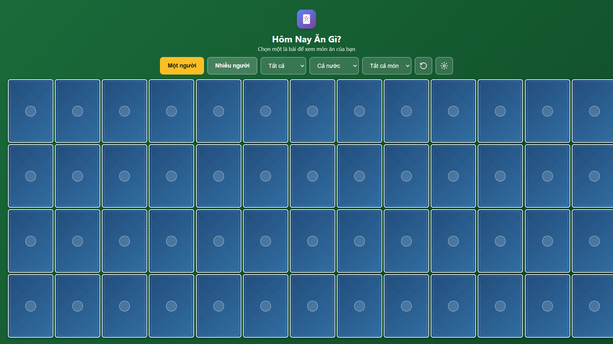
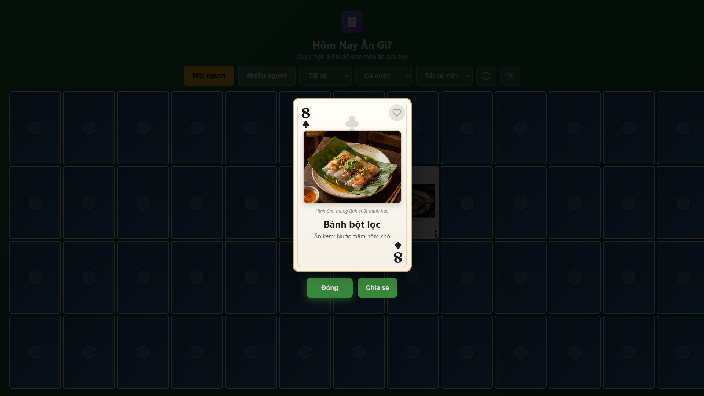
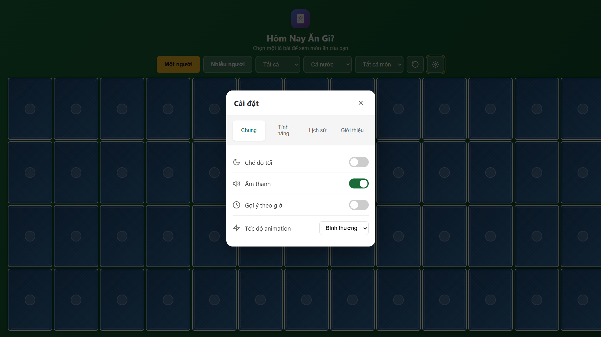

# Hôm Nay Ăn Gì?

Ứng dụng chọn món ăn thú vị với bộ bài 52 lá. Không biết ăn gì? Bốc một lá bài!

---

## Giới thiệu

**Hôm Nay Ăn Gì?** là ứng dụng giúp bạn chọn món ăn mỗi ngày một cách thú vị với bộ bài 52 lá. Mỗi lá bài tương ứng với một món ăn Việt Nam truyền thống.

### Tính năng chính

- 52 món ăn Việt Nam chia theo 4 loại: Bún/Phở, Cơm, Bánh/Xôi, Món khác
- Lọc theo vùng miền: Bắc, Trung, Nam
- Đánh dấu món yêu thích và loại trừ món không thích
- Chế độ nhiều người chơi - chơi cùng bạn bè
- Lên lịch ăn tuần
- Thêm món ăn tùy chỉnh
- Hiệu ứng lật bài đẹp mắt với âm thanh
- Hỗ trợ chế độ tối
- PWA - Cài đặt trên điện thoại để truy cập nhanh
- Chia sẻ kết quả lên mạng xã hội

### Cách sử dụng

1. Mở ứng dụng
2. Chạm vào bất kỳ lá bài nào để xem gợi ý món ăn
3. Sử dụng bộ lọc để thu hẹp theo loại món hoặc vùng miền
4. Đánh dấu yêu thích bằng cách nhấn vào biểu tượng trái tim
5. Chia sẻ kết quả với bạn bè

### Hỗ trợ tác giả

Nếu bạn thấy ứng dụng hữu ích, hãy cân nhắc ủng hộ tác giả:

| Phương thức | Số tài khoản | Tên |
|-------------|--------------|-----|
| MB Bank | 0360126996868 | LE VAN AN |
| Momo | 0976896621 | LE VAN AN |

---

## English

A fun Vietnamese food picker app using a 52-card deck concept. Can't decide what to eat? Just pick a card!

### Features

- 52 Vietnamese dishes organized by category (Noodles, Rice, Pastry, Others)
- Filter by region (North, Central, South Vietnam)
- Mark favorite dishes and exclude dishes you don't like
- Multiplayer mode - play with friends to see who gets the best dish
- Weekly meal planner
- Add custom dishes
- Beautiful card flip animations with sound effects
- Dark mode support
- PWA - Install on your phone for quick access
- Share results as images to social media

### Screenshots





### How to Use

1. Open the app
2. Tap any card to reveal your meal suggestion
3. Use filters to narrow down by category or region
4. Mark favorites by tapping the heart icon
5. Share your result with friends

### Installation

#### Web
Visit the hosted version or run locally:

```bash
# Clone the repository
git clone https://github.com/anlvdt/homnayangi.git

# Navigate to directory
cd homnayangi

# Start a local server
python -m http.server 3000

# Open http://localhost:3000 in your browser
```

#### PWA
1. Open the app in Chrome/Safari
2. Click "Add to Home Screen" or install prompt
3. Use shortcuts for quick actions

### Tech Stack

- HTML5, CSS3, JavaScript (Vanilla)
- Web Audio API for sound effects
- Canvas API for share image generation
- Service Worker for offline support
- LocalStorage for data persistence

### Project Structure

```
homnayangi/
├── index.html          # Main HTML
├── styles.css          # Styles
├── app.js              # Application logic
├── sw.js               # Service Worker
├── manifest.json       # PWA manifest
├── icons/              # App icons
├── images/             # Food images
└── screenshots/        # Screenshots for README
```

## Tác giả / Author

Le An (Vietnam IT)
- GitHub: [@anlvdt](https://github.com/anlvdt)

## Giấy phép / License

MIT License
